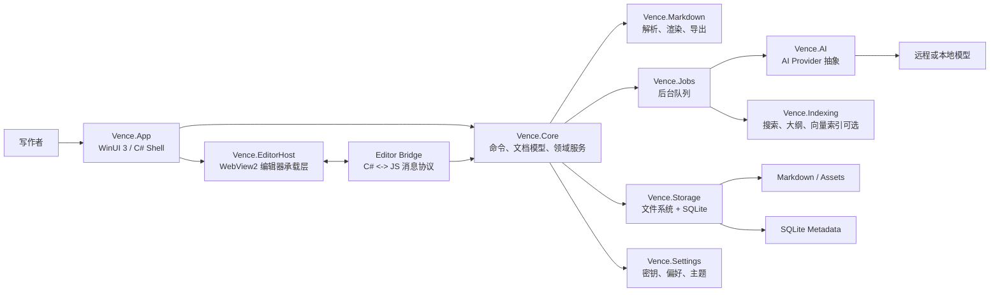

# Vence 文思技术架构

日期：2026-05-28  
状态：Proposal v0.1  
适用范围：桌面端智能编辑器 MVP 到私测版

## 1. 背景

Vence 文思是一款以“以文启思”为核心理念的智能编辑器。现有设计稿强调安静、克制、留白、写作主体性，以及 AI 作为辅助意识而非替代意识的产品观。

本架构默认产品优先面向 Windows 桌面端，用户界面使用 C# 开发；同时保留未来扩展到云同步、跨平台端和协作能力的路径。

## 2. 产品目标

### 2.1 MVP 功能

- 本地文档库：创建、打开、保存、搜索、最近文档、文件夹分组。
- 沉浸式 Markdown 编辑：标题、段落、列表、引用、代码块、链接、图片。
- Markdown 预览与源码视图：支持在编辑、预览、源码之间切换。
- LaTeX 公式、Mermaid 图表、图片插入和导出。
- 智能大纲：从文档结构生成大纲，并允许快速跳转。
- AI 辅助写作：语法检查、补全、润色、格式场景识别。
- 读者模式：从逻辑、矛盾、表达、亮点等角度给出批注。
- 历史记录：基础版本快照、撤销、恢复。

### 2.2 非目标

- MVP 不做多人实时协作。
- MVP 不做复杂云端账号体系。
- MVP 不把 AI 输出直接写入正文，所有修改都必须由用户确认。
- MVP 不追求完整 Office 套件能力。

## 3. 非功能需求

| 维度 | 要求 |
| --- | --- |
| 写作体验 | 输入过程不能被 AI、索引或预览阻塞。 |
| 启动性能 | 冷启动目标小于 2.5 秒，打开最近文档目标小于 1 秒。 |
| 隐私 | 文档默认只保存在本地，调用远程 AI 前必须有明确配置和可见提示。 |
| 可恢复性 | 保存失败、AI 失败、渲染失败时不能损坏原文档。 |
| 可维护性 | 编辑器、存储、AI、导出等能力独立成模块，避免 UI 层直接承载业务规则。 |
| 可替换性 | AI provider、编辑器渲染内核、同步后端都应可替换。 |
| 品牌体验 | UI 低噪音、低信息密度、强 typography，避免“AI 工具 dashboard 化”。 |

## 4. 推荐技术栈

### 4.1 客户端

| 层 | 推荐 | 原因 |
| --- | --- | --- |
| 运行时 | .NET 10 LTS | 2026 年 5 月当前 LTS，适合桌面端长期维护。 |
| UI 框架 | WinUI 3 + Windows App SDK | 微软现代 Windows 桌面 UI 路线，原生 C# / XAML 开发，适合 Windows 10/11。 |
| 编辑器承载 | WinUI 3 Shell + WebView2 Editor Host | Markdown、LaTeX、Mermaid、所见即所得编辑生态在 Web 侧更成熟，C# 负责应用外壳与业务。 |
| 本地数据库 | SQLite + EF Core | 适合本地索引、元数据、版本快照、任务队列。 |
| 文件格式 | Markdown 文件为主，SQLite 存元数据 | 保持内容可迁移、可导出、可版本化。 |
| AI 抽象 | Microsoft.Extensions.AI | 提供 IChatClient、IEmbeddingGenerator 等统一抽象，避免锁死单一模型供应商。 |
| AI 编排 | Semantic Kernel 可选 | 当需要工具调用、复杂读者模式、可观察 agent 流程时引入。MVP 先克制使用。 |
| 日志 | Microsoft.Extensions.Logging + Serilog | 结构化日志，便于定位本地问题。 |
| 测试 | xUnit + FluentAssertions + Playwright/WebView 测试补充 | 覆盖核心逻辑、Markdown 管线、AI provider mock、UI 关键流程。 |

### 4.2 为什么不建议一开始做纯 C# 编辑器内核

纯 C# 文本编辑器可以用 AvaloniaEdit、ICSharpCode.AvalonEdit 或自研文本控件完成基础 Markdown 编辑，但 Vence 的目标包含：

- 所见即所得 Markdown。
- LaTeX 与 Mermaid 渲染。
- 图片、代码块、预览、源码混合。
- AI inline suggestion。
- 读者批注与文档定位。

这些能力如果全部用 C# 原生控件实现，会快速进入编辑器内核研发，风险和工期都高。推荐方案是 C# 负责整体应用体验、窗口系统、设置、文件系统、AI、存储和命令模型；WebView2 内部承载成熟编辑器内核。这样既尊重“C# UI 开发”的偏好，又不把团队拖入底层排版和光标系统。

若后续明确要求跨平台，可评估 Avalonia 替代 WinUI 3；若坚持 Windows-first，则 WinUI 3 更贴合项目气质。

## 5. 架构原则

1. 本地优先：用户的正文、草稿、历史记录默认存在本机。
2. AI 克制：AI 只生成建议，不直接替用户写入正文。
3. 文档可迁移：Markdown 是用户资产，SQLite 是索引和增强层。
4. 模块化单体：MVP 先用模块化单体，避免过早微服务化。
5. 命令驱动：所有编辑、AI 接受、格式调整都通过命令模型进入文档。
6. 后台任务隔离：AI、索引、导出、渲染不能阻塞输入线程。
7. 可观测但隐私优先：默认本地日志，遥测必须 opt-in。

## 6. 高层架构



## 7. 解决方案结构

建议后续代码仓库采用如下 .NET solution：

```text
Vence.sln
src/
  Vence.App/              # WinUI 3 应用入口、窗口、导航、主题
  Vence.EditorHost/       # WebView2 初始化、编辑器资源、桥接协议
  Vence.Core/             # 文档模型、命令、事件、领域服务
  Vence.Markdown/         # Markdown/LaTeX/Mermaid 解析、渲染、导出
  Vence.Storage/          # 文件系统、SQLite、版本快照、搜索索引
  Vence.AI/               # AI provider、prompt、建议对象、读者模式
  Vence.Jobs/             # 后台任务队列、取消、重试、进度
  Vence.Settings/         # 设置、密钥存储、主题偏好
tests/
  Vence.Core.Tests/
  Vence.Markdown.Tests/
  Vence.Storage.Tests/
  Vence.AI.Tests/
  Vence.App.Tests/
editor/
  package.json            # 编辑器前端内核依赖
  src/                    # Web 编辑器、渲染、桥接消息
docs/
  architecture/
  plans/
```

## 8. 模块边界

### 8.1 Vence.App

职责：

- 应用启动、窗口、导航、命令栏、主题切换。
- 左侧文档树、顶部工具栏、右侧 AI 面板、底部状态栏。
- 将用户意图转成 Core 命令。

不负责：

- 不直接读写文档正文。
- 不直接调用 AI。
- 不直接操作 SQLite。

### 8.2 Vence.EditorHost

职责：

- 初始化 WebView2。
- 加载本地编辑器资源。
- 管理 C# 与编辑器 JS 之间的消息协议。
- 将选择范围、光标位置、文档变更传给 Core。

关键约束：

- 桥接消息必须有版本号。
- 编辑器发送的是“意图和变更”，不是任意脚本命令。
- 对从 WebView2 返回的所有数据做 schema 校验。

### 8.3 Vence.Core

职责：

- Document、Workspace、Outline、Suggestion、Annotation 等领域模型。
- SaveDocument、AcceptSuggestion、RejectSuggestion、ApplyFormatting 等命令。
- 文档事件发布。
- Undo/redo 边界定义。

关键规则：

- AI 建议必须先成为 Suggestion，再由用户接受。
- 文档保存必须走 Core，保证快照、索引、事件一致。

### 8.4 Vence.Markdown

职责：

- Markdown AST 解析。
- LaTeX、Mermaid、图片资源引用解析。
- 导出 HTML、PDF、Markdown。
- 场景识别的结构输入。

### 8.5 Vence.Storage

职责：

- 工作区文件读写。
- SQLite 元数据。
- 最近文档、标签、搜索索引。
- 版本快照和恢复。

推荐数据模型：

```text
documents(id, path, title, created_at, updated_at, checksum)
snapshots(id, document_id, created_at, content_hash, diff_path)
suggestions(id, document_id, range_start, range_end, type, status, created_at)
annotations(id, document_id, range_start, range_end, category, content, status)
jobs(id, type, payload_json, status, created_at, updated_at)
settings(key, value_json)
```

### 8.6 Vence.AI

职责：

- Provider 抽象。
- Prompt 模板。
- 语法检查、补全、润色、格式识别、读者模式。
- 输出结构化 Suggestion / Annotation。

AI 输出统一结构：

```json
{
  "type": "grammar|completion|rewrite|format|reader",
  "range": { "start": 120, "end": 188 },
  "message": "这里逻辑可能和前文存在冲突。",
  "replacement": null,
  "confidence": 0.72,
  "reason": "前文说 Vence 偏安静，此处说游客拥挤，需要补充时间或场景限定。"
}
```

### 8.7 Vence.Jobs

职责：

- 后台任务排队。
- 取消、重试、超时。
- 流式 AI 输出转为 UI 可展示状态。
- 输入防抖，避免每个按键触发 AI。

## 9. 数据流

### 9.1 编辑与保存

1. 用户在编辑器中输入。
2. EditorHost 发送文档变更事件。
3. Core 更新内存文档状态。
4. Storage 定时保存草稿。
5. 用户显式保存时，Storage 写 Markdown 文件并生成快照。
6. Jobs 异步更新大纲、搜索索引和预览缓存。

### 9.2 AI 建议

1. 用户选择段落或触发智能功能。
2. App 调用 Core 创建 AI job。
3. AI 模块读取必要上下文，进行脱敏和范围裁剪。
4. Provider 返回结构化建议。
5. Core 将结果保存为 Suggestion 或 Annotation。
6. App 在右侧面板或 inline UI 展示。
7. 用户接受后，Core 执行 ApplySuggestion 命令并写入文档。

### 9.3 读者模式

读者模式不应像评分系统，而应像“第一位认真阅读的人”。建议按四类输出：

- 逻辑：前后矛盾、因果不清、论证跳跃。
- 表达：句式、重复、语气不一致。
- 结构：标题层级、段落顺序、信息密度。
- 亮点：写得好的句子、值得保留的表达。

## 10. 安全与隐私

- 默认不上传全文。
- AI 请求必须显示 provider、模型和发送范围。
- API Key 使用 Windows Credential Manager 或 DPAPI 保护。
- 日志不得记录正文全文和密钥。
- WebView2 禁止任意外链导航，编辑器资源优先本地加载。
- Mermaid、HTML 预览要做内容隔离，避免脚本执行。
- 导入外部 Markdown 时，将远程图片和 HTML 视为不可信内容。

## 11. 部署与更新

MVP 推荐：

- 开发版：自包含发布目录。
- 内测版：MSIX 或安装器。
- 更新：GitHub Releases + 手动更新提示；私测后再做自动更新。

未来：

- Windows Package Manager 发布。
- 可选云同步服务。
- 可选用户账号和授权。

## 12. ADR

### ADR-001：Windows-first，采用 WinUI 3 + Windows App SDK

决策：MVP 使用 WinUI 3 开发桌面客户端。

原因：

- 用户明确偏向 C# UI。
- 产品概念图是桌面编辑器形态。
- WinUI 3 是微软现代 Windows 桌面 UI 框架，适合 Fluent、触控、高 DPI 和原生窗口体验。

替代方案：

- WPF：成熟但视觉和现代控件成本更高。
- Avalonia：跨平台更强，但 Windows 原生质感和生态需要更多打磨。
- Electron：编辑器生态强，但偏离 C# UI 偏好，资源占用更高。

后果：

- MVP 聚焦 Windows，速度更快。
- 若未来需要 macOS/Linux，需要抽象 Core 与 Storage，并评估 Avalonia 或 Web 端。

### ADR-002：编辑器采用 WebView2 混合承载

决策：C# UI 外壳 + WebView2 编辑器内核。

原因：

- Markdown、LaTeX、Mermaid、所见即所得、inline suggestion 在 Web 编辑器生态更成熟。
- C# 层仍控制应用框架、数据、AI、命令和安全。
- 可以先交付高质量写作体验，而不是长期自研光标和排版系统。

替代方案：

- 纯 C# 文本控件：MVP 简单，但高级编辑体验风险高。
- 全 Web/Electron：开发快，但不符合偏好的 C# UI 方向。

后果：

- 需要认真设计 C# <-> JS bridge。
- 需要额外测试 WebView2 生命周期、消息协议和离线资源加载。

### ADR-003：Markdown 文件为内容真源，SQLite 存增强数据

决策：正文以 Markdown 文件保存，SQLite 保存索引、历史、批注、建议、设置。

原因：

- 用户内容可迁移，不被私有格式锁定。
- SQLite 适合本地查询和轻量事务。
- 可以保留未来同步和版本管理空间。

替代方案：

- 全部存 SQLite：结构化强，但降低用户对内容所有权的信任。
- 自定义二进制格式：可控但不适合文思的开放写作气质。

后果：

- 需要处理文件外部修改和 SQLite 元数据同步。
- 需要 checksum 和快照机制保证一致性。

### ADR-004：AI provider 通过 Microsoft.Extensions.AI 抽象

决策：AI 模块依赖 Microsoft.Extensions.AI 抽象，具体 provider 可替换。

原因：

- 避免锁死单一模型供应商。
- 方便测试和 mock。
- 后续可接入远程模型、本地模型或企业内网模型。

替代方案：

- 直接调用某个模型 SDK：上线快，但长期迁移成本高。
- 一开始引入完整 agent 框架：能力强，但 MVP 复杂度偏高。

后果：

- 初期需要定义统一 Suggestion / Annotation schema。
- 当读者模式复杂化时，再引入 Semantic Kernel 做工具编排。

### ADR-005：先做模块化单体，后续再拆云服务

决策：MVP 只做桌面模块化单体，不引入独立后端。

原因：

- 当前核心价值是写作体验，不是云协作。
- 本地优先符合隐私和创作者主体性。
- 减少账号、计费、同步、运维带来的早期负担。

后果：

- 远程 AI 调用由客户端直接配置或经轻量代理实现。
- 若未来做商业化和同步，需要新增 Vence.Cloud 服务。

## 13. 主要风险

| 风险 | 影响 | 缓解 |
| --- | --- | --- |
| WebView2 与 C# bridge 复杂 | 编辑体验和调试成本上升 | 先定义协议，做最小 spike，再扩展能力。 |
| AI 延迟破坏写作节奏 | 用户感觉软件打扰 | 所有 AI 走后台任务和手动触发，补全使用防抖和取消。 |
| 所见即所得范围过大 | MVP 延期 | MVP 先支持 Markdown 常用块，复杂块走预览。 |
| 隐私信任不足 | 产品定位受损 | 默认本地，AI 请求可见，日志不存正文。 |
| 视觉气质落入普通 AI 工具 | 品牌差异消失 | UI 决策以概念图和项目风格文档为约束。 |
| 未来跨平台需求 | WinUI 3 迁移成本 | Core、Storage、AI 不依赖 WinUI，UI 保持薄层。 |

## 14. 验收标准

MVP 达到以下状态即可进入私测：

- 用户可以创建、编辑、保存、重新打开 Markdown 文档。
- 输入过程稳定，连续写作 30 分钟无卡死和丢字。
- 支持大纲、预览、源码、LaTeX、Mermaid、图片基础能力。
- 至少三类 AI 建议可用：语法检查、润色、读者模式。
- AI 建议必须可接受、拒绝、撤销。
- 文档默认本地保存，远程 AI 请求范围可见。
- 安装包可在干净 Windows 11 机器运行。

## 15. 参考资料

- Microsoft: [.NET and .NET Core Support Policy](https://dotnet.microsoft.com/en-us/platform/support/policy/dotnet-core)
- Microsoft Learn: [WinUI 3](https://learn.microsoft.com/en-us/windows/apps/winui/winui3/)
- Microsoft Learn: [Get started with WebView2 in WinUI 3 apps](https://learn.microsoft.com/en-us/microsoft-edge/webview2/get-started/winui)
- Microsoft Learn: [Microsoft.Extensions.AI libraries](https://learn.microsoft.com/en-us/dotnet/ai/microsoft-extensions-ai)
- Microsoft Learn: [Semantic Kernel overview](https://learn.microsoft.com/en-us/semantic-kernel/overview/)
- Microsoft Learn: [SQLite EF Core Database Provider](https://learn.microsoft.com/en-us/ef/core/providers/sqlite/)
